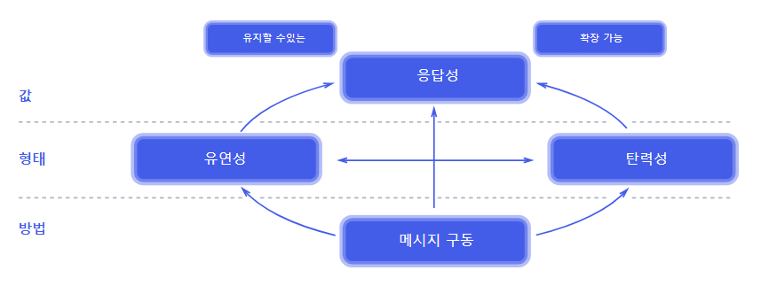

# 01 리액티브 시스템과 리액티브 프로그래밍

### 1.1 리액티브 시스템(Reactive System)

- 어떤 이벤트나 상황이 발생했을 때 적절하게 행동하는 것
- 반응을 잘 하는 시스템
    - 클라이언트 요청에 즉각적으로 응답 → 지연시간을 최소화한다!

### 1.2 리액티브 선언문



- 제대로된 리액티브 시스템을 구축하는 방법
- 리액티브라는 용어의 의미를 올바르게 정의하고자하는 사람들이 리액티브 시스템 구축을 위해 만든 일종의 설계원칙/ 리액티브 시스템의 특징!
- 리액티브 선언문 → 리액티브 시스템이 지향하는 바가 무엇인지 명확하게 알 수 ㅇ
- 방법(Means)
    - 리액티브 시스템에서 주요 통신 수단으로 뭐 활용할 지
    - → **비동기 메시지 기반 통신** (느슨한 결합, 격리성, 위치 투명성)
- 형태(FORM)
    - 메시지 기반 통신을 통해 시스템이 어떤 형태 지니는지
        - **탄력성, 회복성**을 가져야함
        - 탄력성: 시스템 작업량이 변화해도 일정한 응답 유지 → 시스템 자원을 적절하게 조절, 대응
        - 유연성: 시스템 장애가 발생해도 응답성을 유지 → 비동기 메시지 기반 통신으로 느슨한 결합과 격리성을 보장, 장애 발생 부분만 복구하면 됨
- 핵심가치(VALUE)
    - 비동기 메시지 기반 통신을 바탕으로 한 회복성, 예측 가능한 규모 확장 알고리즘
    - → 시스템의 처리량을 자동으로 확장 및 축소(탄력성 확보) → 즉각적 응답가능 시스템 구축가능
- 대규모 분산 시스템 or 멀티코어 기반의 클라우드 시스템, 모바일 시스템 등 **빠른 응답성을 바탕으로 유지보수와 확장이 용이한 시스템 구축**에 활용가능

### 1.3 리액티브 프로그래밍이란

- 리액티브 시스템을 구축하는 데 필요한 프로그래밍 모델
- 리액티브 시스템에서 비동기 메시지 통신은 Non-Blocking I/O 방식의 통신임
    - Blocking: 해당 스레드 작업 끝날 때까지 스레드는 대기 대기, 별도 스레드 추가할당 필요
    - Non-Bloking: 스레드 차단 ㄴㄴ

### 1.4 리액티브 프로그래밍 특징

> In computing, reactive programming is a **declarative programming** paradigm concerned with **data streams** and **the propagation of change**
> 

- **선언형 트로그래밍**
    - 실행할 동작을 구체적 명시 x 목표만 선언
- data streams, the propagation of change
    - 지속적으로 데이터 발생
    - → 변화하는 이벤트로 보고 이벤트 발생시키면서 계속적 전달
        - 데이터 소스 변경이 있을 때마다 데이터 전파

### 1.5 코드로 보는 명령형 프로그래밍 vs 선언형 프로그래밍

```java
List<Integer> numbers = Arrays.asList(1,3,21,10,8,11);
int sum = 0;
for (int n: numbers) {
  sum + n;
}

sout(sum)
```

- 실행할 동작 구체적 명시, 명령형 프로그래밍

```java
List<Integer> numbers = Arrays.asList(1,3,21,10,8,11);
int sum = numbers.stream()
			.filter(number -> number>6 && (number % 2 != 0))
			.mapToInt(number -> number)
			.sum();

sout(sum)
```

- 누군가에게 해달라고 부탁하는 느낌
- 선언만 하면 내부에서 처리해줌 → 선언형 프로그래밍
    - 동작을 구체적으로 명시하지 않고 목표만 선언
    - 여러 가지 동작을 별도의 코드로 분리 x 각 동작에 대해 **메서드 체인을 형성**해서 한 문장으로 된 코드로 구성 → 입력으로 들어오는 데이터를 어떤 식으로 처리할 지 한 눈에 알아볼 수 ㅇ
        - 코드가 간결해지고 가독성 좋아짐
    - 선언형 프로그래밍 방식을 함수형 프로그래밍으로 구성됨

### 1.6 리액티브 프로그래밍 코드 구성

- Publisher
    - 발행자 → 입력으로 들어오는 데이터를 제공한다
- Subscriber
    - 구독자, 소비자 → Publisher가 제공한 데이터를 전달받아 사용
- Data Source(=Data Stream)
    - Publisher 입력으로 들어오는 데이터
- Operator
    - Publisher로부터 전달된 데이터가 애플리케이션의 요구사항에 맞게 적절한 가공처리가 이루어짐
    - 가공 처리 담당 Operator!
    - 데이터 생성, 데이터 필터링, 변환 등 수많은 Operator 존재