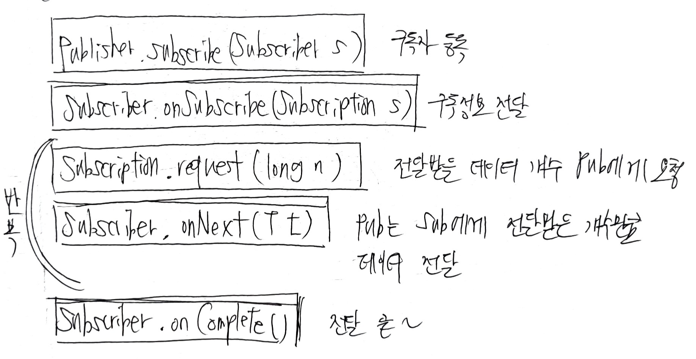
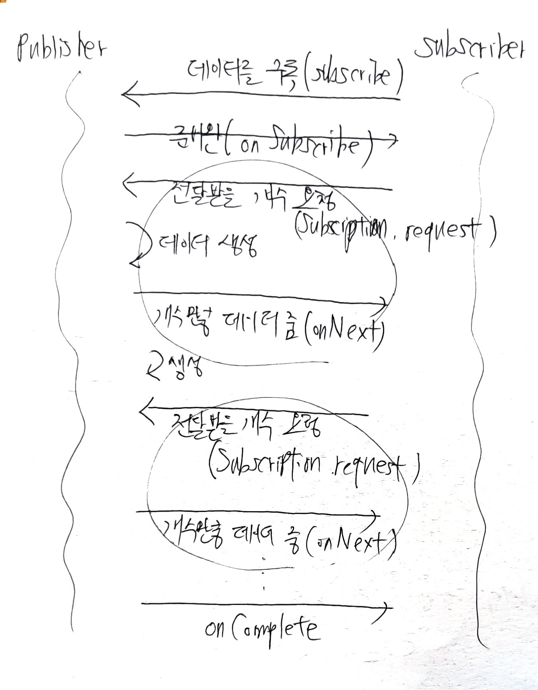

# 02 리액티브 스트림즈

<br>

### 2.1 리액티브 스트림즈?

- 리액티브한 코드 구성을 용이하게 해주는 리액티브 라이브러리가 있어야함
- 구현 표준 사양 → 리액티브 스트림즈
    - 데이터 스트림을 Non-Blocking 이면서 비동기적인 방식으로 처리하기 위한 리액티브 라이브러리의 표준 사양
    - 구현체 다양함

<br><br>

### 2.2 리액티브 스트림즈 구성요소

- Publisher, Subscriber, Subscription, Processor
- Publisher: 데이터 생성 및 통지
- Subscriber: 구독한 Pub에게 데이터 전달받아서 처리
- Subscription: 요청할 데이터 개수 지정, 구독 취소
- Processor: Pub + Sub

1. Subscriber는 전달받을 데이터 구독 → subscribe
2. Publisher는 데이터를 통지할 준비 됐다 알림 → onSubscribe
3. Subscriber는 전달받기 원하는 데이터개수만큼 Pub에게 요청 → Subscription.request
4. Pub는 Subscriber로부터 요청받은 데이터 통지 → onNext
5. Pub가 모든 데이터 통지 → 데이터 전송완료를 Subscriber에게 알림 → onComplete
    - 에러 발생 시에는 onError를 알림

- 비동기적 상호작용
    - Publisher가 통지하는 속도가 Subscriber가 처리하는 속도보다 더 빠르면 시스템 부하가 커짐
    - 그래서 데이터 개수를 제어한다

<br><br>

### 2.3 코드로 보는 리액티브 스트림즈 컴포넌트

```java
public interface Publisher<T> {
	public void subscribe(Subscriber<? super T> s); //Subscriber 등록
}
```

- 리액티브 스트림즈에서 Publisher와 Subscriber는 개념상으로는 Subscriber가 구독하는 게 맞는데, 실제 코드상에서는 Publisher가 subscribe 메서드의 파라미터를 등록하는 형태

```java
public interface Subscriber<T> {
  public void onSubscribe(Subscription s); //구독 시작 시점 처리(개수지정 or 구독취소)
	public void onNext(T t); //Publisher가 통지한 데이터 처리
  public void onError(Throwable t);  //에러발생 시 에러 처리
  public void onComplete();  //Pulisher 데이터 통지 완료 시 호출 -> 후처리
}
```

```java
public interface Subscription {
  public void request(long n); //Publisher에게 데이터 개수 요청
  public void cancel(); //구독 해지
}
```

```java
public interface Processor<T, R> extends Subscriber<T>, Pulisher<R> {
}
```



- 개념적인 순서



- 메서드 순서

<br><br>

## 2.4 리액티브 스트림즈 관련 용어 정리

- 자주 사용 용어들

### Signal

- Publisher와 Subscriber 간에 주고받는 상호작용
- onSubscribe, onNext, request, cancel 등 메서드를 말함
    - Pub이 Subscriber에게 보내는 Signal: onNext, onSubscribe 등
    - Sub가 Pub에게 보내는 Signal: request, cancel

### Demand

- 수요, 요구
- Sub가 Pub에게 요청하는 데이터 (아직 전달하지 않음)

### Emit

- Pub가 Sub에게 데이터를 전달하는 것
- 입력으로 들어오는 데이터를 제공
- 데이터를 정달하기 위한 Pub의 Sinal → onNext = 데이터를 emit한다

### Upstream, DownStream

```java
Flux
		.just(1,2,3,4,5,6)
		.filter(n -> n%2 == 0)
		.map(n -> n*2)
		.subscribe(System.out::println);
```

- 데이터가 흐른다
- just 메서드로 데이터 생성 후 emit → fliter → map
    - 메서드체인
    - 아래로 내려갈 수록 DownStream

### Sequence

- Publisher가 emit하는 데이터의 연속적인 흐름을 정의해 놓은 것 자체
- Sequence는 Operator 체인 형태로 정의됨
    - Fux를 통해 데이터 생성, emit 후 filter 메서드를 통해 필터링, map 메서드를 통해 변환 과정 = sequence
    - Operator로 데이터의 연속적인 흐름을 정의한 것 ㅇㅇ

### Operator

- 연산자의 의미
- just, filter, map → 연산자
- 리액티브 프로그래밍은 Operator로 시작해서 Operator로 끝난다
    - 리액티브 프로그래밍의 핵심

### Source

- Data Source, Source PUblisher, Source Flux
- 최초의 의미

<br><br>

## 2.5 리액티브 스트림즈의 구현 규칙

- 컴포넌트 구현 규칙 정의되어 있음
- 구현체를 올바르게 이해하고 제대로 사용하기 위해 기본적인 구현 규칙은 알자

### Publisher 구현 주요 기본 규칙

1. Pub가 Subscriber에게 보내는 onNext signal의 총 개수는 항상 해당 Subscriber의 구독을 통해 요청된 데이터의 총 개수보다 더 작거나 같다
2. Publisher는 요청된 것보다 적은 수의 onNext signal을 보내고 onComplete또는 onError를 호출하여 구독을 종료할 수 있음
3. Publisher의 데이터 처리 실패 → onError signal 보내야함
4. Publisher가 데이터 처리 성공적 종료 → onComplete Signal 보내야함
5. Pub가 Sub에게 onError, onComplete signal → 해당 Subscriber의 구독은 취소된 것으로 간주
6. 종료상태 SInal → 더 이상 signal이 발생되면 안됨
7. 구독 취소 → Subscriber는 signal받는 거 중지해야함

### Subscriber 구현 주요 기본 규칙

1. Sub는 Publisher로부터 onNext signal 수신 위해 Subscription.request(n)으로 Demand signal을 pub에게 보내야함
2. Subscriber.onComplete, onError는 Subscription이나 Publisher 메서드 호출하면 안됨
3. Subscriber.onComplete, onError는 signal을 수신한 후 구독 취소로 간주해야함
4. 구독 더이상 필요하지 않으면 Subscription.cancel을 호출해야함
5. Subscriber.onSubscribe()는 지정된 Subscriber에 대해 최대 한 번만 호출해야함

### Subscription 구현 주요 기본 규칙

1. 구독은 Subscriber가 onNext, onSubscribe 내에서 동기적으로 Subscription.request를 호출하도록 허용해야함
    - request와 onNext 사이의 상호 재귀로 인해 발생할 수 있는 스택 오버플로 피하기 위해
    - 동기적 호출 → request를 호출하는 스레드와 onNext signal을 보내는 스레드가 동일할 수 있다는 것
2. 구독 취소 후 추가적으로 호출되는 request는 효력 없어야함
3. 구독 취소 후 추가적 호출되는 cancel은 효력 없어야함
4. 구독 취소되지 않은 동안 request의 매개변수가 0보다 작거나 같으면 IllegalArgumentException과 함께 onError signal을 함께 보내야함
5. 구독 취소되지 않은 동안 cancel은 Pub가 Subscriber에게 보내는 signal을 결국 중지하도록 요청해야함
6. 구독 취소되지 않은 동안 cancel은 Publisher에게 해당 구독자에 대한 참조를 삭제하도록 요청해야함
7. **cancel, request 호출에 대한 예외를 던지는거 허용 x**
    - 메서드 호출 시 유효한 값 이외에 어떤 예외도 던지지 않는다 → Return normally
8. 구독은 무제한 수의 request호출을 지원해야하고, 최대 2^63 -1개의 Demand를 지원해야함

<br><br>

## 2.6 리액티브 스트림즈 구현체

- RxJava
- Project Reactor
    - Spring Framework 팀에 의해 주도적으로 개발된 리액티브 스트림즈 구현체
- Akka Streams
- Java Flow API
    - Flow API는 리액티브 스트림즈 구현체 x SPI로써 java API에 정의된 것임
    - 하나의 인터페이스만 바라볼 수 있는 단일 창구로서의 역할을 기대하는 거임