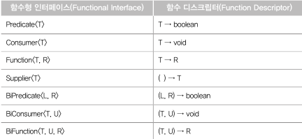

# 04 리액티브 프로그래밍을 위한 사전 지식

## 4.1 함수형 인터페이스

- 단 하나의 추상 메서드만 정의되어있는 인터페이스
    - defuault 메서드는 제외, 추상 메서드만 하나면 됨
- 함수형 프로그래밍 세계 ⇒ 함수를 일급 시민으로 취급함
    - 함수를 값으로 취급한다
    - 함수 자체를 파라미터로 전달가능
- 함수형 인터페이스를 이용해 함수를 값으로 취급할 수 있다
- 함수형 프로그래밍 방식에 맞게 표현할 수 있는 방법 = 람다 표현식

## 4.2 람다 표현식

- 함수형 인터페이스를 구현한 클래스의 메서드 구현
- 메서드 자체를 파라미터로 전달 x → 함수형 인터페이스를 구현한 클래스의 인터페이스를 전달
- 람다 표현식에서는 파라미터로 전달받은 변수 + 람다 표현식 외부에서 정의된 변수도 사용가능(람다 캡처링)
    - 람다 표현식에서 사용되는 자유변수는 final 또는 final같은 효력을 지녀야함

## 4.3 메서드 레퍼런스

```java
(Car car) -> car.getCarName()  

Car::getCarName
```

- 함수형 인터페이스의 추상 메서드를 간결하게 작성하는 법 = 메서드 레퍼런스
- 람다표현식의 몸체에 기술되는 메서드 이름만 사용

### 4가지의 유형이 있음

1. ClassName::static method 유형
    
    ```java
    StringUtils::upperCase
    ```
    
2. ClassName::instance method 유형
    
    ```java
    String::toUpperCase
    ```
    
3. object::instance method 유형
    
    ```java
    PaymentCalculator calculator = new PaymentCalculator();
    
    calculator::getTotalPayment
    ```
    
4. ClassName::new 유형
    
    ```java
    PaymentCalculator::new
    ```
    

### 4.4 함수 디스크립터(Function Descriptor)

- 함수 서술자, 함수 설명자
- 일반화된 람다 표현식을 통해서 이 함수형 인터페이스가 어떤 파라미터를 가지고, 어떤 값을 리턴하는지 설명해 주는 역할을 함
    - Java에서는 다양한 형태의 함수형 인터페이스에 대응하는 함수 디스크립터를 정의해놓음
- 자주 사용하는 함수형 인터페이스와 함수 디스크립터
    - 새롭게 정의된 함수형 인터페이스들!



### Predicate

```java
public interface Predicate<T> {
  boolean test(T t);
}

filter(cc -> cc.getPrice() > 50)
```

- java에서 함수형 인터페이스 중 구현해야 되는 추상 메서드가 하나의 파라미터 가지고, 리턴값 boolean 타입 값 반환하는 함수형 인터페이스
- 흔하게 볼 수 있는 것 → 스트림의 filter 메서드
    - 파라미터로 Predicate를 가짐

### Comsumer

```java
public interface Consumer<T> {
  void accept(T t);
}
```

- 데이터를 소비한다 → 리턴 값이 없다
- 예시: 일정 주기별로 특정 작업을 수행한 후, 결과값을 리턴할 필요 없는 경우가 대부분인 배치처리

### Function

```java
public interface Function<T, R> {
  R apply(T t);
}
```

- 추상 메서드가 하나의 파라미터를 가지며, 리턴값 R
- 예시: 자바 스트림의 map 메서드

### Supplier

```java
public interface Supplier<T> {
  T get();
}
```

### Bixxxx

- BiPredicate, BiConsumer 등의 함수형 인터페이스 → 파라미터 하나 더 추가 ㅇㅇ
    - 기본 함수형 인터페이스의 확장형이라고 보면 될듯