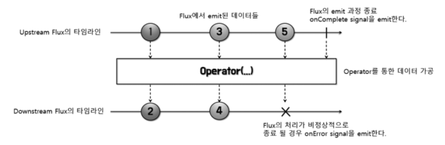

# 06 마블 다이어그램(Marble Diagram)

## 6.1 마블 다이어그램이란?

- 구슬 모양의 도형으로 구성된 도표
- 비동기적인 데이터 흐름을 시간의 흐름에 따라 시각적으로 표시한 다이어그램
- Reactor에서 지원하는 Operator를 이해하는 데 중요한 역할을 함


1. 다이어그램에는 두 개의 타임라인이 존재
    - 첫 번째 → Publisher가 데이터를 emit하는 타임라인
    - Publisher는 최초로 emit하는 애가 아닐 수도 있다. Operator 함수를 기준으로 상위에 있는 Upstream의 Publisher
2. Operator에서 나가는 점선 화살표: Operator에서 리턴하는 새로운 Publisher로 Downstream에 가공된 데이터 전달

## 6.2 마블 다이어그램으로 Reactor의 Publisher 이해하기

### **Mono 마블 다이어그램**


- Mono는 0개 또는 한 개 데이터를 emit하는 Publisher
    - emit되지 않고 onComplete sigal만 전송될 수 있음
    - 1건의 데이터를 응답으로 보내는 HTTP 요청/응답에 사용하기 적합

```java
Mono.just("Hello Reactor")
        .subscribe(System.out::println);		
```

- 데이터 1건을 emit
- just Operator
    - 2개 이상의 데이터를 파라미터로 전달 → 내부적으로 fromArray() operator를 이용해 데이터를 emit함

```java
Mono
    .empty()
    .subscribe(
        //Publisher가 onNext signal 전송 시 실행
        none -> System.out.println("# emitted onNext signal"), 
        //Publisher가 onError signal 전송 시 실행 -> 전송도중 에러 발생시 exception 형태로 전달받기 위해 
        error -> {},
        //Publisher가 onComplete singal 전송 시 실행
        () -> System.out.println("# emitted onComplete signal")
    );
```

- 데이터를 1건도 emit하지 않는 코드
    - empty() operator를 사용ㅇㅇ 하나도 emit안하고 onComplete signal을 전송함
- map() Operator 내부의 로그도 출력되지 않음
    - empty operator: 내부적으로 emit할 데이터가 없다고 간주하여 곧바로 onComplete
- 어떤 특정 작업을 통해 데이터를 전달받을 필요는 없지만 작업이 끝났음을 알리고 이에 따른 후처리를 하고싶을 때 사용

### **Flux 마블 다이어그램**



- emit되는 데이터가 여러 개
- 0개 또는 1개이상의 데이터 emit가능 → Mono의 데이터 emit범위 포함

```java
Flux.just(6,9,13)
        .map(num -> num % 2)
        .subscribe(System.out::println);
```

- 2로 나눈 나머지를 subscriber에게 전달하여 출력함

```java
Flux.fromArray(new Integer[]{3,6,7,9})
        .filter(num -> num > 6)
        .map(num -> num * 2)
        .subscribe(System.out::println);
```

- 배열 원소들 차례로 emit
- filter() Operator에서 배열원소 전달받아 6보다 큰 숫자만 필터링
- map() Operator

### **2개의 Mono를 연결해서 Flux로 변환**


```java
Flux<String> flux = 
		Mono.justOrEmpty("steve")
				.concatWith(Mono.justOrEmpty("Jobs"));
flux.subscribe(System.out::println);
```

- justOrEmpty() Operator
    - just() 는 파라미터값으로 null 허용 x
    - justOrEmpty()는 null 허용 → 내부적으로 empty() Operator를 호출하도록 구현됨
- concatWith(): 호출하는 Publisher와 파라미터 Publisher가 각각 emit하는 데이터 연결해서 새로운 Publisher의 데이터 소스로 만들어줌
- 연결된 소스는 새로운 Flux의 데이터 소스가 되어 차례대로 emit함(새로운 flux로 리턴)
- (참고) 데이터 자체를 이어 붙여 하나의 데이터 emit 하는 게 아니라 emit할 데이터를 일렬로 줄 세워 하나의 데이터 소스를 만들 만들어 차례차례 데이터 emit함
    - 데이터 자체 연결 x 두 개의 데이터 소스를 연결해 하나로 만든다!

### 여러 개의 데이터소스 연결

```java
Flux.concat(
            Flux.just("Mercury", "Venus", "Earth"),
            Flux.just("Mars", "Jupiter", "Saturn"),
            Flux.just("Uranus", "Neptune", "Pluto"))
        .collectList()
        .subscribe(planets -> System.out.println(planets));

// [Mercury, Venus, Earth, Mars, Jupiter, Saturn, Uranus, Neptune, Pluto]
```

- concatWith(): 2개의 데이터 소스만 연결가능
- concat(): 여러 개의 데이터소스 연결가능
- collectList(): Upstream Publisher에서 emit하는 데이터를 모아 List의 원소로 포함시킨 새로운 데이터 소스로 만들어주는 Operator

- concat()의 리턴타입 → Flux
    - 9개의 데이터를 데이터소스로 연결하기 때문
- collectList()의 리턴타입 → Mono
    - 여러 개의 데이터를 하나의 List에 원소로 포함시킴
    - List에 포함된 원소는 여러 개지만 List 자체는 하나