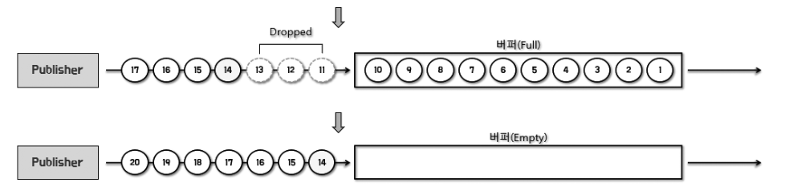

# 08 Backpressure

## 8.1 Backpressure란?

- Publisher로부터 전달받은 데이터를 안정적으로 처리하기 위한 수단

  - Publisher가 끊임없이 emit하는 무수히 많은 데이터를 적절하게 제어 → 데이터 처리에 **과부하가 걸리지 않도록** 제어

- Subscriber가 데이터를 처리하는 속도가 느려서 처리가 끝나기 전에 Publisher가 데이터를 계속 emit한다면??
  - 처리되지 않고 대기 중인 데이터가 지속적으로 쌓임 → 오버플로 발생/ 시스템 다운 가능성
  - 해결하기 위한 수단, Backpressure
- 데이터를 처리하는 쪽은 Subscriber 뿐만 아니라 Downstream Publisher도 포함
  - 데이터를 전달받아 처리하는 Downstream Publisher = Downstream Consumer
  - 원본 Flux에서 emit된 데이터는 여러 Operator를 거친 후, 최종적으로 Subscriber에게 전달됨
    - Operator는 각 처리 과정을 끝내고 리턴값으로 Flux나 Mono를 return함
  - Flux, Mono = Dowstream Publisher

## 8.1 Reactor에서 Backpressure 처리 방식

- Reactor에서는 다양한 방식으로 Backpressure를 지원함

### 8.2.1 데이터 개수 제어

```java
Flux.range(1, 5)
		.doOnRequest(data -> log.ingo(data))
		.subscribe(new BaseSubscriber<Integer>() {
			@Override
			protected void hookOnSubscribe(Subscription subcription) {
				request(1);
			}

			@SneakyThrows
			@Override
			protected void hookOnNext(Integer value) {
				log.info(value);
				request(1);
      }
)
```

- 데이터 요청 개수를 직접적으로 제어하는 Backpressure방식 쓰고싶다 → **BaseSubscriber**사용
- Subscriber가 적절히 처리할 수 있는 수준의 데이터 개수를 Publisher에게 요청하는 것
  - Subscriber가 request() 메서드를 통해 적절한 개수를 요청
  - hookOnSubscribe는 onSubscribe메서드 대신해 구독 시점에 request 호출, 최초 데이터 요청 개수 제어함
  - hookOnNext() 메서드로 onNext 메서드를 대신해 Publisher emit 데이터를 받아서 처리, 다시 요청함

### 8.2.2 Backpressure 전략 사용

- Reactor에서 제공하는 Backpressure 전략 사용

- **IGNORE 전략**: Backpressure를 사용 x
- **ERROR 전략**: DownStream으로 전달할 데이터가 버퍼에 가득 찰 경우 Exception 발생
- **DROP 전략**: Downstream으로 전달할 데이터가 버퍼에 가득 찰 경우, 버퍼 밖에서 대기하는 먼저 emit된 데이터부터 Drop
- **LATEST 전략**: Downstream으로 전달할 데이터가 버퍼에 가득 찰 경우, 버퍼 밖에서 대기하는 가장 최근에 emit된 데이터부터 버퍼에 채움
- **BUFFER 전략**: Downstream으로 전달할 데이터가 버퍼에 가득 찰 경우, 버퍼 안에 있는 데이터부터 Drop

### IGNORE

- Downstream에서의 Backpressure 요청이 무시 > IllegalStateException 발생가능

### ERROR

- Downstream의 데이터 처리 속도가 느려서 Upstream의 emit 속도를 따라가지 못할 경우 IllegalStateException 발생시킴
- Publisher는 Error Signal을 Subscriber에게 전송하고 삭제한 데이터는 폐기

- error 전략 사용 코드

```jsx
Flux
	.interval(Duration.ofMillis(1L)) //0부터 1씩 증가한 숫자를 0.001초에 한 번씩 빠른속도 emit
	.onBackpressureError()  //Error 전략 사용
	.doOnNext(data _> log.info(data)) //emit한 데이터 확인 등 용도
	.publishOn(Schedulers.parallel()) // Reactor Sequence 중 일부를 별도의 스레드에서 실행할 수 있게 해주는 애
	.subscribe( data -> {
							try {
								Thread.sleep(5L); //데이터 처리 5초
							} catch (InterruptedException e) {}
							log.info(data);
					},
					error -> log.error("onError"));

	Thread.sleep(2000L);
```

- OverflowException 발생하면서 Sequence가 종료됨 (IllegalStateException)

### DROP (버퍼 바깥쪽 데이터 폐기)



- Publisher가 Downstream으로 전달할 데이터가 버퍼에 가득 찰 경우 ,
- 버퍼 밖에서 대기중인 데이터 중 먼저 emit된 데이터부터 drop
- (버퍼 밖 대기공간이 따로 있는건가?)

```jsx
Flux
	.interval(Duration.ofMillis(1L)) //0부터 1씩 증가한 숫자를 0.001초에 한 번씩 빠른속도 emit
	.onBackpressureDrop(dropped -> log.info(dropped))  //Error 전략 사용
	.doOnNext(data _> log.info(data)) //emit한 데이터 확인 등 용도
	.publishOn(Schedulers.parallel()) // Reactor Sequence 중 일부를 별도의 스레드에서 실행할 수 있게 해주는 애
	.subscribe( data -> {
							try {
								Thread.sleep(5L); //데이터 처리 5초
							} catch (InterruptedException e) {}
							log.info(data);
					},
					error -> log.error("onError"));

	Thread.sleep(2000L);
```

- Drop된 데이터를 파라미터로 전달받을 수 있음 → Drop된 데이터가 폐기되기 전에 추가 작업 수행가능
- 버퍼가 가득 찬 상태에서는 버퍼가 비워질 때까지 데이터를 DROP함

### LATEST 전략 (버퍼 바깥쪽 데이터 폐기)


- 버퍼가 가득 찰 경우 버퍼 밖에서 대기 중인 데이터 중에서 최근에 emit된 데이터부터 버퍼에 채우는 전략
- 데이터가 계속 emit, 버퍼 밖에서 대기함
- 버퍼가 비워지면 가장 최근에 emit된 숫자부터 버퍼에 채워짐(이전 유지 데이터 계속 폐기함)

```jsx
Flux
	~~
	.onBackpressureLatest()
```

- 최근에 emit된 데이터.. 다음 데이터가 emit되면 다시 폐기!
- DROP은 나를 폐기/ LATEST는 내 앞에 있는 누군가를 폐기

### BUFFER 전략

- 컴퓨터 시스템에서 버퍼 → 입출력을 수행하는 장치들 간 속도차이 조절위해 입출력 장치 중간에 데이터를 어느 정도 쌓아두고 전송하는 거
- 버퍼의 데이터를 폐기하지 않고 버퍼링/ 버퍼가 가득 차면 버퍼 내의 데이터를 폐기, 버퍼가 가득 차면 에러 발생 전략 지원함

- 버퍼가 가득 찼을 때 버퍼 내의 데이터를 폐기하는 전략 ㄱㄱ
- 버퍼 전략 DROP_LATEST, DROP_OLDEST 알아보자

### BUFFER DROP_LATEST


- Publisher가 Downstream으로 전달한 데이터가 버퍼에 가득 찰 경우, 가장 최근에 버퍼 안에 채워진 데이터를 Drop하고 emit된 데이터를 채우는 전략
- 버퍼 오버플로 일으킨 가장 최근 데이터 폐기

```jsx
Flux
	.interval(Duration.ofMillis(300L))
	.doOnNext(data -> log.info("# emitted by original Flux: ()", data))
	.onBackpressureBuffer(2, //버퍼의 최대 용량
			dropped -> log.info(), //DROP되는 데이터를 받아 후처리
			BufferOverflowStrategy.DROP_LATEST)
	.doOnNext(data -> log.info("[ # emitted by Buffer: {} ]", data))
	.publishOn(Schedulers.parallel(), false, 1) //스레드 하나 추가, prefetch 수를 1로 설정
	.subscribe( data -> {
							try {
								Thread.sleep(5L); //데이터 처리 5초
							} catch (InterruptedException e) {}
							log.info(data);
					},
					error -> log.error("onError"));

	Thread.sleep(3000L);
```

- 원본 Flux(interval() Operator)에서 생성된 원본 데이터 확인
- Buffer에서 DownStream으로 emit되는 데이터 확인

- prefetch: Scheduler가 생성하는 스레드의 비동기 경계 시점에 미리 보관할 데이터의 개수를 의미, 데이터의 요청 개수에 영향을 미침

### BUFFER DROP_OLDEST

- 데이터가 버퍼에 가득 찰 경우, 버퍼 안 데이터 중 가장 오래된 데이터를 Drop하여 폐기, 확보된 공간에 emit된 데이터를 채움
- 버퍼 오버플로 발생 → 버퍼 안에 채워진 데이터 중 가장 오래된 데이터가 DROP

```java
Flux
	.interval(Duration.ofMillis(300L))
	.doOnNext(data -> log.info("# emitted by original Flux: ()", data))
	.onBackpressureBuffer(2, //버퍼의 최대 용량
			dropped -> log.info(), //DROP되는 데이터를 받아 후처리
			BufferOverflowStrategy.DROP_OLDEST)
	.doOnNext(data -> log.info("[ # emitted by Buffer: {} ]", data))
	.publishOn(Schedulers.parallel(), false, 1) //스레드 하나 추가, prefetch 수를 1로 설정
	.subscribe( data -> {
							try {
								Thread.sleep(5L); //데이터 처리 5초
							} catch (InterruptedException e) {}
							log.info(data);
					},
					error -> log.error("onError"));

	Thread.sleep(3000L);
```
