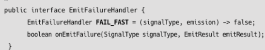

# 09.Sinks

## 9.1 Sinks란?

- 리액티브 스트림즈의 구성요소 중 하나인 Processor

  - Reactor에서는 Processor의 인터페이스를 구현한 클래스인 FluxProcessor, MonoProcessor, EmitterProcessor 지원함
  - Processor의 기능을 개선한 Sinks가 Reactor 3.4.0버전부터 지원되기 시작, 곧 없어질듯

- Sinks는 리액티브 스트림즈의 Signal을 프로그래밍 방식으로 푸시할 수 있는 구조
- Flux 또는 Mono의 의미 체계를 가짐

- Flux또는 Mono가 onNext같은 Signal을 내부적으로 전송해주는 방식
- Sinks 사용하면 프로그래밍 코드를 통해 명시적으로 Signal 전송가능
  - Reactor에서 프로그래밍 방식으로 Signal 전송하는 가장 일반적인 방법 → generate() create() 사용하는 거
  - generate(), create() Operator는 싱글스레드 기반에서 Signal 전송함
  - Sinks는 멀티스레드 방식으로 Signal을 전송해도 스레드 안전성 보장 → 예기치 않은 동작으로 이어지는 것 방지해줌

```java
Flux
		.create((FluxSink<String> sink) -> {
			IntStream
						.range(1, tasks)
						.forEach(n -> sink.next(doTask(N)));
		})
		.subscribeOn(Schedulers.boundedElastic())
		.doOnNext(n -> log.info())
		.publishOn(Schedulers.parallel())
		.map(result -> result + " success!")
		.doOnNext(n -> log.info(n))
		.publishOn(Schedulers.parallel())
		.subscribe(data -> log.info(data));

Thread.sleep(500L);

---

private static String doTasks(int taskNumber) {
	return "task " + taskNumber + " result";
}
```

1. create(): 처리해야 할 작업의 개수만큼 doTask() 메서드 호출, 작업 처리 후 결과받음
2. map(): 추가적으로 가공처리 후 최종적으로 Subscriber에게 전달
   - 작업을 처리하는 단계, 처리 결과를 가공하는 단계, 가공된 결과를 Subscriber에게 전달하는 단계 모두 별도의 스레드에서 실행하도록 구성함
   - 작업을 처리하는 스레드 → subscribeOn에서 지정
   - 처리 결과를 가공하는 스레드는 publishOn에서 지정
   - 가공된 결과를 Subscriber에게 전달하는 스레드는 마지막에 publishOn에서 처리
3. 원본 데이터를 생성하는 create()에서는 subscirbeOn()에서 지정한 스레드를 사용해서 생성한 데이터 emit함

- create Operator를 사용해서 프로그래밍 방식으로 Signal을 전송할 수 있다
- Reactor Sequence를 단계적으로 나누어서 여러 개의 스레드로 처리 가능

- 위 코드에서 작업을 처리한 후, 그 결과 값을 반환하는 doTask() 메서드가 여러 스레드에서 각각의 전혀 다른 작업들을 처리한 후, 처리 결과를 반환하는 상황 발생할 수 있음
  - 여기서 적절하게 사용할 수 있는 방식 → Sinks

```java
Sinks.Many<String> unicastSink = Sinks.many().unicast().onBackpressureBuffer();
Flux<String> fluxView = unicastSink.asFlux();
IntStream
				.range(1, tasks)
				.forEach(n -> {
						try{
								new Thread(() -> {
									unicastSink.emitNext(doTask(n), Sinks.EmitFailureHandler.FAIL_FAST);
									log.info(n);
								}).start();
								Thread.sleep(100L);
						} catch (InterruptedException e) {
								log.error(e.getMeesage());
						}
				});

fluxView
			.publishOn(Schedulers.parallel())
			.map(result -> result + " success!")
			.doOnNext(n -> log.info(""))
			.publishOn(Schedulers.parallel())
			.subscribe(data -> log.info(data));
```

- doTask() 메서드가 루프를 돌 때마다 새로운 스레드 생성됨
- doTask()의 작업 처리 결과를 sinks를 통해 DownStream에 emit함
- Sinks는 프로그래밍 방식으로 Signal을 전송가능, 멀티 스레드 환경에서 스레드 안정성을 보장받을 수 있는 장점이 있다
  - Sinks의 경우에는 동시 접근을 감지하고, 동시 접근하는 스레드 중 하나가 빠르게 실패함으로써 스레드 안정성을 보장함

## 9.2 Sinks 종류 및 특징

- Reactor에서 SInks를 사용하여 프로그래밍 방식으로 Signal을 전송할 수 있는 방법은 크게 두 가지임
  1. Sinks.One 사용
  2. Sinks.Many 사용

### Sinks.One

```java
public final class Sinks {
	public static <T> Sinks.One<T> one() {
		return SinksSpecs.DEFAULT_ROOT_SPEC.one();
	}
}
```

- Sinks.one() 메서드를 사용해서 한 건의 데이터를 전송하는 방법을 정의해 둔 기능 명세
- Sinks.One은 한 건의 데이터를 프로그래밍 방식으로 emit하는 역할을 하기도 하고
  - Mono 방식으로 Subscriber가 데이터를 소비할 수 있도록 해주는 Sinks 클래스 내부에 인터페이스로 정의된 SInks의 스펙 또는 사양
- Sinks.one() 메서드를 호출 → 한 건의 데이터를 프로그래밍 방식으로 emit하는 기능을 사용하고 싶으니 거기에 맞는 적당한 기능 명세를 달라고 요청하는 것과 같음

```java
Sinks.One<String> sinkOne = Sinks.one();
Mono<String> mono = sinkOne.asMono();

sinkOne.emitValue("hello reacotor", FAIL_FAST);
//sinkOne.emitValue("hello reacotor", FAIL_FAST);

mono.subscribe(data -> log.info(data));
mono.subscribe(data -> log.info(data));
```

- Sinks.one() 메서드 호출 → Sinks.One 기능 명세를 리턴, Sinks.One 객체로 데이터를 emit가능
- emitValue는 emit도중 에러가 발생 시 어떻게 처리할 것인지에 대한 핸들러
- FAIL_FAST 는 내부에 다음과 같이 정의되어있다



- 람다식으로 표현한 EmitFailureHandler 인터페이스 구현 객체
- 이 객체 통해 emit 도중 발생 에러 빠르게 처리함
  - 에러 발생 시 재시도를 하지 않고 즉시 실패처리를 한다
- 빠른 실패 처리 → 스레드 간의 경합 등으로 발생하는 교착 상태등을 미연에 방지가능 → 스레드 안정성 보장 가능

- emit한 데이터를 구독하여 전달받기 위해 asMono()로 Mono객체 변환
  - Reactor API문서 → asMono() 메서드를 통해 Sinks.One에서 Mono객체로 변환할 수 있는 것 → Mono의 의미체계를 가진다 라고 표현함
- Mono 객체를 통해 emit된 데이터 전달 받을 수 ㅇ

- 주석 해제시 빠르게 드랍됨
  - Sinks.One 으로 아무리 많은 수의 데이터를 emit해도
  - 처음 emit한 데이터 외에 나머지 데이터는 emit되지 x (Drop됨)

### SInks.Many

- Sinks.many() 메서드를 사용해서 여러 건의 데이터를 여러 가지 방식으로 전송하는 기능을 정의해 둔 기능명세

```java
public static ManySpec many() {
	return SinksSpecs.DEFAULT_ROOT_SPEC.many();
}
```

- Sinks.one() 의 경우 Sinks.One 을 리턴하는 반면, Sinks.many() 경우 SInks.Many를 return하지 않고 ManySpec이라는 인터페이스 리턴
  - 데이터 emit을 위한 여러가지 기능이 정의된 ManySpec
  - SInks.One의 경우 단순히 한 건 데이터를 emit하는 한 가지 기능만 가짐 → 별도의 Spec 정의되지 않고 Default Spec 사용함
  - ManySpec은 총 세 가지 기능을 정의, 세 기능은 각각의 기능을 또다시 별도의 Spec으로 정의해두고 있음(UnicastSpec, MulticastSpec, MulticastReplaySpec)


- ManySpec의 구현 메서드인 unicast() 호출함
  - onBackpressureBuffer() 메서드 호출
- 주석 해제 시 → UnicastSpec은 단 하나의 Subscriber에게만 데이터를 emit하는거임,에러발생
  - IllegalStateException
  - UnicastSpec에서 단 하나의 Subscriber에게 데이터를 emit하기 위해서 내부적으로 UnicastProcessor를 사용

```java
Sinks.Many<Integer> multicastSink =
			Sinks.many().multicast().onBackpressureBuffer(); //MulticasttSpec.onBackpressureBuffer()
Flux<Integer> fluxView = multicastSink.asFlux();

multicastSink.emitNext(1, FAIL_FAST);
multicastSink.emitNext(2, FAIL_FAST);

fluxView.subscribe(data -> log.info(data));
fluxView.subscribe(data -> log.info(data));

multicastSink.emitNext(3, FAIL_FAST);
```

- ManySpec의 구현 메서드 중 multicast() 메서드 호출
- MulticastSpec의 기능 = 하나 이상의 Subscriber에게 데이터를 emit
  - 3개의 데이터를 emit, subscribe() 메서드를 두 번 호출(구독 2번 발생)
- Sinks가 Publisher 역할을 할 경우 → Hot Publisher로 동작함
  - onBackpressureBuffer() 메서드는 Warm up의 특징을 가지는 HotSequence로 동작
  - 첫 번째 구독이 발생한 시점에 DownStream쪽으로 데이터 전달됨

```java
  //limit: emit된 데이터 중 가장 나중에 emit된 데이터부터 2개 전달
	Sinks.Many<Integer> replaySink = Sinks.many().replay().limit(2);
	Flux<Integer> fluxView = replaySink.asFlux();

	replaySink.emitNext(1, FAIL_FAST);
	replaySink.emitNext(2, FAIL_FAST);
	replaySink.emitNext(3, FAIL_FAST);

	fluxView.subscribe(data -> log.info(data));

	replaySink.emitNext(4, FAIL_FAST);

	fluxView.subscribe(data -> log.info(data));
```

- reply → MulticastReplaySpec을 리턴, limit() 메서드 호출함
- MulticastReplaySpec에는 emit된 데이터를 다시 reply해서 구독 전 이미 emit된 데이터도 Subscriber가 전달받을 수 있는 메서드들 정의됨
- all() → 구독 전 이미 emit된 데이터가 있어도 처음 emit된 데이터부터 모든 데이터가 subcriber에게 전달됨
- limit() → emit된 데이터 중2개만 뒤로 돌려서 전달한다!

```java
Flux
	.interval(Duration.ofMillis(300L))
	.doOnNext(data -> log.info("# emitted by original Flux: ()", data))
	.onBackpressureBuffer(2, //버퍼의 최대 용량
			dropped -> log.info(), //DROP되는 데이터를 받아 후처리
			BufferOverflowStrategy.DROP_OLDEST)
	.doOnNext(data -> log.info("[ # emitted by Buffer: {} ]", data))
	.publishOn(Schedulers.parallel(), false, 1) //스레드 하나 추가, prefetch 수를 1로 설정
	.subscribe( data -> {
							try {
								Thread.sleep(5L); //데이터 처리 5초
							} catch (InterruptedException e) {}
							log.info(data);
					},
					error -> log.error("onError"));

	Thread.sleep(3000L);
```
