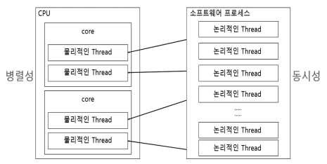

# 10 Scheduler

<br/><br/><br/>

## 10.1 스레드의 개념 이해

- Reactor에서 사용되는 Scheduler = Reactor Sequence에서 사용되는 **스레드를 관리해 주는 관리자**
- 컴퓨터 시스템에서의 스레드 구분
  - 물리적인 스레드
  - 논리적인 스레드
- CPU코어는 CPU의 명령어를 처리하는 반도체 유닛
  - 코어 개수가 많으면 더 많은 수의 명령어를 더 빠르게 병렬처리 가능
  - 듀얼코어 4 스레드 → 물리적인 스레드를 의미
  - 물리적인 스레드 = 논리적인 코어 (코어를 나눴으니 ㅇㅇ)

### 물리적인 스레드

- 듀얼코어 4스레드
- 하나의 코어는 두 개의 스레드를 포함함
  - 스레드 = 물리적인 코어를 논리적으로 나눈 것 = 물리적인 스레드

### 논리적인 스레드

- sw적으로 생성되는 스레드(java 프로그래밍에서 사용되는 스레드)
- 논리적인 스레드 = 프로세스 내에서 실행되는 세부 작업의 단위
  - 이론적으로는 메모리가 허용하는 범위 내에서 얼마든지 만들 수 있지만 물리적인 스레드의 가용 범위 내에서 실행가능



- 논리적인 스레드와 물리적인 스레드의 관계
- 물리적인 스레드 → **병렬성**과 관련
  - 물리적인 스레드가 실제로 동시실행 → 여러 작업 동시 처리
- 논리적인 스레드 → **동시성**과 관련
  - 동시에 실행되는 것처럼 보이는 것
  - 물리적인 스레드의 총 개수보다 더 많은 논리적인 스레드 동시실행 ㄴㄴ 물리적인 스레드 개수 내에서 실행됨

<br/><br/><br/>

## 10.2 Scheduler란?

- Reactor에서의 Scheduler: OS에서 사용되는 Scheduler와 비슷
  - OS내에서 Scheduler: 실행되는 프로그램인 프로세스를 선택하고 실행하는 등의 프로세스 라이프 사이클을 관리해줌
  - Reactor의 Scheduler: 비동기 프로그래밍을 위해 사용되는 스레드 관리
    - 어떤 스레드에서 뭐 처리할지 지정
- 자바 프로그래밍에서 멀티스레드 제어 → 스레드의 Race Condition 등을 신중하게 고려해서 코드를 작성해야함
  - 코드 복잡도 높아지고 오류발생 확률 upup!
- Reactor에서는 Scheduler를 통해 이런 문제 최소화가능
  - **Sceduler가 스레드의 제어를 대신해줌** → 직접 제어해야하는 부담 x

<br/><br/><br/>

## 10.3 Scheduler를 위한 전용 Operator

- subscribeOn(), publishOn() → Scheduler 전용 Operator
  - 파라미터로 적절한 Scheduler를 전달 → 해당 Scheduler 특성에 맞는 스레드가 Reactor Sequence에 할당됨
- parallel() 이라는 operator도 있음

### 1) subscribeOn()

- 구독이 발생한 직후 실행될 스레드를 지정하는 Operator
- 구독이 발생하면 원본 Publisher가 데이터를 최초로 emit함
  - **원본 Publisher의 동작을 수행하기 위한 스레드**이다!

```java
Flux.fromArray(new Integer[] {1,3,5,7})
				.subscribeOn(Schedulers.boundedElastic())
				.doOnNext(data -> log.info(data)) //[boundedElastic-1]
				.doOnSubscribe(subscription -> log.info("# doOnSubscribe")) //[main]
				.subscribe(data -> log.info(data)); //[boundedElastic-1]

Thread.sleep(500L);
```

- **구독 발생 직후** 원본 Publisher의 동작을 처리하기 위한 스레드 할당
  - 원본 Publisher = 원본 Flux = 원본 데이터소스틑 emit
  - boundedElastic 유형의 Scheduler를 지정함 → 원본 flux의 동작을 처리하는 스레드
- doOnNext(): 원본 Flux에서 emit되는 데이터를 출력
- **doOnSubscribe()**: **구독 발생 시점에 추가적인 처리 필요 시** 해당 처리 동작 추가가능(스레드 확인)
  - 최초 실행 스레드 = main

### 2) publishOn()

- DownStream으로 Signal을 전송할 때 실행되는 스레드를 제어하는 역할
- 코드상에서 **publishOn()기준 아래쪽인 Downstream의 실행 스레드 변경함**
  - 파라미터로 Scheduler를 지정 → 해당 Scheduler특성을 가진 스레드로 변경가능

```java
Flux.fromArray(new Integer[] {1,3,5,7})
				.doOnNext(data -> log.info("{}", data)) //[main]
				.doOnSubscribe(subscription -> log.info("# doOnSubscribe")) //[main]
				.publishOn(Schdulers.parallel()) //얘 기준 downstream 실행 스레드 변경
				.subscribe(data -> log.info(data)); //[parallel-1]

Thread.sleep(500L);
```

- DownStream으로 데이터를 emit하는 스레드를 변경

### 3) parallel()

- 물리적인 스레드는 병렬성을 가지고, 논리적인 스레드는 동시성을 가짐

  - subscribeOn(), publishOn() → 동시성을 가지는 논리적인 스레드
  - **parallel()** → **병렬성을 가지는 물리적인 스레드**

- parallel()은 **라운드 로빈 방식으로 CPU 코어 개수만큼의 스레드를 병렬로 실행**함
  - CPU 코어 개수 = 논리적인 코어(물리적 스레드)의 개수

```java
Flux.fromArray(new Integer[]{1,3,5,7,9})
				.parallel()
				.runOn(Schedulers.parallel()) //실제 병렬 작업 수행하는 스레드 할당
				.subscribe(data -> log.info(data));

Thread.sleep(100L);
```

- 원본 Flux가 숫자 emi하는데 parallel() 추가 → 5개의 숫자를 병렬로 처리함
  - 코어 6개, 논리적인 코어12개
- parallel() 만 추가한다해서 emit되는 데이터를 병렬로 처리 ㄴㄴ
  - parallel()은 **emit된 데이터를 CPU의 논리적인 코어 수에 맞게 골고루 분배하는 역할**만 함
  - 실제로 **병렬 작업을 수행할 스레드 할당은 runOn()**이 함

+) Reactor에서 라운드 로빈 방식으로 CPU의 논리적인 코어 수에 맞게 데이터를 그룹화한 것 = rail

```java
Flux.fromArray(new Integer[]{1,3,5,7,9})
				.parallel(4) //4개만 쓰겠다!
				.runOn(Schedulers.parallel()) //실제 병렬 작업 수행하는 스레드 할당
				.subscribe(data -> log.info(data));

Thread.sleep(100L);
```

- 어떤 작업을 처리하기 위해 물리적인 스레드 전부를 사용할 필요 없는 경우
  - → 사용하고자 하는 스레드 개수를 지정해주면 됨

<br/><br/><br/>

## 10.4 publishOn()과 subscribeOn()의 동작 이해

- 함께 사용하면 실행 스레드는 어떻게 동작?
  - Operator를 어떤 식으로 사용하느냐 따라 실행 스레드의 동작이 조금씩 달라짐

### 1) publishOn()과 subscribeOn()을 사용하지 않는 경우


- Operator 체인에서 실행되는 스레드 동작과정
- Scuduler를 추가 x
  - 최초 스레드는 main 스레드
  - subscriber가 데이터를 전달받아 처리하는 과정까지 모두 main에서 실행

```java
Flux
		.fromArray(new Integer[] {1,3,5,7})         //main
		.doOnNext(data -> log.info(data))
		.filter(data -> data>3)       //main
		.doOnNext(data -> log.info(data))
		.map(data -> data * 10)       //main
		.doOnNext(data -> log.info(data))
		.subscribe(data -> log.info(data));       //main
```

- 모두 main스레드로 실행

### 2) publishOn() 하나만 사용


- publishOn() 이후 지정한 해당 Scheduler 유형의 스레드만 실행

```java
Flux
		.fromArray(new Integer[] {1,3,5,7})
		.doOnNext(data -> log.info(data)) //main
		.publishOn(Schedulers.parallel())
		.filter(data -> data>3)
		.doOnNext(data -> log.info(data)) //parallel-1
		.map(data -> data * 10)
		.doOnNext(data -> log.info(data)) //parallel-1
		.subscribe(data -> log.info(data)); //parallel-1
```

### 3) publishOn()을 두 번 사용


- 이후 계속 B스레드가 사용됨
- Operator 체인 상에서 한 개 이상의 publishOn() 을 사용하여 실행 스레드를 목적에 맞게 적절하게 분리할 수 있음

```java
Flux
		.fromArray(new Integer[] {1,3,5,7})
		.doOnNext(data -> log.info(data)) //main
		.publishOn(Schedulers.parallel())
		.filter(data -> data>3)
		.doOnNext(data -> log.info(data)) //parallel-2
		.publishOn(Schedulers.parallel()
		.map(data -> data * 10)
		.doOnNext(data -> log.info(data)) //parallel-1
		.subscribe(data -> log.info(data)); //parallel-1
```

### 4) subscribeOn(), publishOn() 함께 사용


- **subscribeOn(): 구독 발생 직후**에 실행될 스레드 지정
  - fromArray() → A스레드
  - publishOn()이 추가될 때까지 A스레드 (filter)
- **publishOn() 추가 이후** Operator 체인은 B스레드에서 실행

```java
Flux
		.fromArray(new Integer[] {1,3,5,7}) //boundedElastic-1
		.subscribeOn(Schedulers.boundedElastic())
		.doOnNext(data -> log.info(data))
		.publishOn(Schedulers.parallel())
		.filter(data -> data>3)             //boundedElastic-1
		.doOnNext(data -> log.info(data))
		.publishOn(Schedulers.parallel()
		.map(data -> data * 10)             //parallel-1
		.doOnNext(data -> log.info(data))
		.subscribe(data -> log.info(data)); //parallel-1
```

- publishOn() 이전까지 boundedElastic-1 스레드에서 실행
  - 이후는 parallel-1 스레드 실행
- 함께 사용하면 원본 Publisher에서 데이터를 emit하는 스레드와 emit된 데이터를 가공 처리하는 스레드를 적절하게 분리할 수 ㅇ

<br/><br/><br/>

## 10.5 Scheduler의 종류

### 1) Schedulers.immediate()

- 별도의 스레드를 추가적으로 생성 x 현재 스레드에서 작업을 처리하고자 할 때 사용가능

```java
Flux
		.fromArray(new Integer[] {1,3,5,7})
		.publishOn(Schedulers.parallel())
		.filter(data -> data>3)             //parallel-1
		.doOnNext(data -> log.info(data))
		.publishOn(Schedulers.immediate())
		.map(data -> data * 10)             //parallel-1
		.doOnNext(data -> log.info(data))
		.subscribe(data -> log.info(data)); //parallel-1
```

- 어떤 API들 중 공통의 역할을 하는 API이고, 해당 API의 파라미터로 Scheduler를 전달할 수 있다
- API를 사용하는 입장에서 Operator 체인 작업은 원래 실행되던 스레드에서 실행하고 싶을 때도 있어
  - Scheduler가 필요한 API가 있긴 한데 별도의 스레드를 추가 할당하고 싶지 않을 경우 ㅇㅇ 사용

### 2) Schedulers.single()

- 스레드를 하나만 생성해서 Scheduler가 제거되기 전까지 재사용하는 방식

```java
public static void main(String[] args) throws InterruptedException {
	doTask("task1")
				.subscribe(data -> log.info("{}", data)); //single-1 항상!

	doTask("task2")
				.subscribe(data -> log.info("{}", data)); //single-1

	Thread.sleep(200L);
}

private static Flux<Integer> doTask(String taskName) {
	return Flux.fromArray(new Integer[] {1,3,5,7})
					.publishOn(Schedulers.single())
					.filter(data -> data > 3)
					.doOnNext(data -> log.info(data) //single-1
					.map(data -> data * 10)
					.doOnNext(data -> log.info(data)); //single-1
}
```

- doTask() 라는 메서드를 호출해서 각자 다른 작업을 처리함
- Sceduler.single()을 사용해서 → doTask() 첫 번째 호출에서 생성한 스레드 재사용함
- 하나의 스레드를 재사용하면서 다수의 작업 처리가능
  - 지연시간이 짧은 작업을 처리하는 게 효과적

### 3) Schedulers.newSingle()

- 호출할 때마다 매번 새로운 스레드 하나를 생성

```java
public static void main(String[] args) throws InterruptedException {
	doTask("task1")
				.subscribe(data -> log.info("{}", data)); //new-single-1

	doTask("task2")
				.subscribe(data -> log.info("{}", data)); //new-single-2

	Thread.sleep(200L);
}

private static Flux<Integer> doTask(String taskName) {
	return Flux.fromArray(new Integer[] {1,3,5,7})
					.publishOn(Schedulers.newSingle("new-single", true))
					.filter(data -> data > 3)
					.doOnNext(data -> log.info(data)
					.map(data -> data * 10)
					.doOnNext(data -> log.info(data));
}
```

- 파라미터: 생성할 스레드 이름 + 스레드를 데몬 스레드로 동작하게 할 지 엽부
  - 데몬 스레드: 보조 스레드, 주 스레드가 종료되면 자동종료 특성
- doTask() 메서드를 호출할 때마다 새로운 스레드를 하나 생성해서 작업처리

### 4) Schedulers.boundedElastic()

- ExecutorService 기반의 스레드 풀을 생성한 후, 그 안에서 정해진 수만큼의 스레드를 사용하여 작업을 처리하고, 작업이 종료된 스레드는 반납하여 재사용하는 방식
- 기본적으로 CPU 코어 수 x 10만큼의 스레드를 생성
- 풀에 있는 모든 스레드가 작업 처리 중이라면 → 이용 가능한 스레드가 생길 때까지 최대 10만 개의 작업이 큐 대기 가능
- fromArray() 같은 Operator의 데이터 소스로 적은 수의 데이터 수동전달보단, 데이터베이스 통한 질의나 HTTP 요청 같은 Blocking I/O 작업을 통해 전달받은 데이터를 데이터 소스로 많이 사용
  - boudedElastic()은 이런 Blocking I/O 작업 효과적으로 처리하기 위한 방식
  - 실행 시간이 긴 Blocking I/O작업 포함경우 → 다른 Non-Blocking 처리에 영향 안주도록 전용 스레드 할당하여 처리하기 때문에 시간을 효율적으로 사용할 수 있음

### 5) Schedulers.fromExecutorService()

- 기존에 이미 사용하고 있는 ExecutorService가 있다면 얘로부터 Scheduler를 생성하는 방식
- ExecutorService로부터 직접 생성할 수도 있지만 Reactor에서 권장하진 x

### 6) Schedulers.nexXXXX()

- Schedulers.single(), Schedulers.boundedElastic(), Schedulers.parallel()은 Reactor에서 제공하는 디폴트 Scheduler 인스턴스를 사용함
- 하지만 필요하다면 schedulers.newSingle(), Schedulers.newBoundedElastic(), Schedulers.newParallel() 메서드 사용, **새로운 Scheduler 인스턴스 생성가능**
- 스레드 이름, 생성가능 디폴트 스레드 개수, 스레드 유휴시간, 데몬 스레드로의 동작 여부를 직접 지정해서 커스텀 스레드 풀 새로 생성가능
