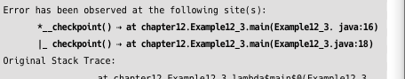

# 12 Debugging

## 12.1 Reactor에서의 디버깅방법

- 동기식 또는 명령형 프로그래밍 방식
  - Exception 발생 시 → 스택 트레이스를 확인하거나
  - 예외 발생 예상 코드에 브레이크 포인트를 걸어 문제 발생 원인을 단계적으로 찾아갈 수 있음
  - 상대적으로 디버깅이 쉽다!
- Reactor는 처리되는 작업들

  - 대부분 비동기적 실행,
  - Reactor Sequence는 선언형 프로그래밍 방식으로 구성되므로 디버깅이 쉽지 않음

- Reactor의 디버깅의 어려움을 최소화하기 위해 Reactor에서 제공하는 방법들!

### 12.1.1 Debug Mode를 사용한 디버깅

- Reactor에서는 디버그 모드를 활성화해서 Reactor Sequence를 디버깅가능

```java
public static Map<String, String> fruits = new HashMap<>();

static {
	fruits.put("banana", "바나나");
	fruits.put("apple", "사과");
	fruits.put("pear", "배");
	fruits.put("grape", "포도");
}

public static void main(String[] args) throws InterruptedException {
		Hooks.onOperatorDebug();

		Flux
			.fromArray(new String[]("BANANAS", "APPLES", "PEARS", "MELONS"))
			.subscribeOn(Schedulers.boundedElastic())
			.publishOn(Schedulers.parallel())
			.map(String::toLowerCase)
			.map(fruits::get)
			.subscribe(
					log::info,
					error -> log.error("# onError: ", error)
			);

		Thread.sleep(100L);
}
```

- Reactor에서 디버그 모드 활성화 → **Hooks.onOperatorDebug()**
- +) Operator 체인에 map Operator가 꽤 많음 → 너무 많으면 성능상 오버헤드가 발생할 수 있다는 경고메시지 옴 - 실무에서는 자제

- 그냥 예외 발생 → 스택트레이스에서 의미 있는 내용을 확인하기 힘듦
- Hooks.onOperatorDebug()
  - 에러가 발생한 지점을 정확히 가리킴
  - 에러가 시작된 지점부터 에러 전파 상태를 표시해줌
  - Operator 체인이 시작되기 전에 디버그 모드를 활성화하면 에러가 발생한 지점을 좀 더 명확하게 찾을 수 ㅇ
- Hooks.onOperatorDebug() 한계
  - 디버그 모드 활성화 → 애플리케이션 내에서 **비용이 많이 드는 동작과정**을 거침
  - 애플리케이션 내에 있는 **모든 Operator의 스택트레이스를 캡쳐**함
  - 에러 발생 시 캡처한 정보를 기반으로 **에러가 발생한 Assembly의 스택트레이스를 원본 스택트레이스 중간에 끼워 넣는다**
- 에러 원인 추적위해 처음부터 디버그 모드를 활성화하는 것 권장 x

### **Assembly**

- Reactor의 Operator들은 대부분 Mono 또는 Flux를 리턴함 → Operator 체인을 형성할 수 ㅇ
- **Operator에서 리턴하는 새로운 Mono 또는 Flux가 선언된 지점** = Assembly

### **Traceback**

- 디버그 모드를 활성화하면 Operator의 Assembly 정보를 캡쳐함 → 에러가 발생한 Operator의 스택트레이스를 캡처한 Assembly 정보 = Traceback
- Traceback은 Suppressed Exception 형태로 원본 스택트레이스에 추가된다

### **+) 프로덕션 환경에서의 디버깅 설정**

- Reactor → 애플리케이션 내 모든 Operator 체인의 스택트레이스 캡처 비용을 지불하지 않고 디버깅 정보 추가할 수 있도록 별도의 Java 에이전트를 제공함
- Spring Webflux 기반의 애플리케이션을 제작하여 프로덕션 환경에서 사용하려면
  - ReactorDebugAgent 활성화 해야함!
  - compile ‘io.projectreactor:reactor-tools’를 build.gradle에 추가하자
  - spring.reactor.debug-agent.enabled 프로퍼티 값이 true이면
    - 애플리케이션 시작 시 ReactorDebugAgent.init()이 자동호출되며 ReactorDebugAgent가 활성화됨
    - (디폴트 값이 true다!)
  - false 설정 시
    - 애플리케이션 시작 전 ReactorDebugAgent.init()을 직접 호출해줘야함

### 12.1.2 checkpoint() Operator를 사용한 디버깅

- 디버그 모드를 활성화 ⇒ 애플리케이션 내에 있는 모든 Operator에서 스택트레이스 캡쳐
- checkpoint() Operator 사용 시 ⇒ 특정 Operator 체인 내의 스택트레이스만 캡쳐함
- checkpoint()를 이용하는 방법
  1. Traceback을 출력하는 방법
  2. Traceback 출력 없이 식별자를 포함한 Description을 출력해서 에러 발생 지점 예상
  3. Traceback과 Description을 모두 출력하는 방법

**<Traceback을 출력하는 방법>**

- checkpoint()를 사용하면 실제 에러가 발생한 assembly 지점 또는 assemply 지점의 traceback이 추가됨

```java
Flux
		.just(2,4,6,8)
		.zipWith(Flux.just(1,2,3,0), (x,y) -> x/y)
		.map(num -> num + 2)
		.checkpoint()
		.subscribe(
					data -> log.info("# onNect: {}", data),
					error -> log.error("# onError:", error)
		);
```

- checkpoint() 지점에 새로운 로그가 추가됨
  - \*\_checkpoint → at project.MyProject.mai(Example12_2.java: 13)
  - checkpoint() 지점까지는 에러가 전파되었다는 걸 알 수 있음
  - 직접적으로 발생했거나/ 에러가 전파됨
- zipWith()
  - 원본 Flux와 zipWith() 파라미터로 입력된 Flux를 하나의 Flux로 합치는중
  - 람다표현식에서 → 두 개의 Flux에서 emit하는 데이터를 순차적으로 1쌍씩 전달받아 새로운 값을 만드는 중

```java
Flux
		.just(2,4,6,8)
		.zipWith(Flux.just(1,2,3,0), (x, y) -> x/y)
		.checkpoint()
		.map(num -> num + 2)
		.checkpoint()
		.subscribe(
					data -> log.info("# onNext: {}", data),
					error -> log.error("# onError:", error);
		)
```

- 에러가 예상되는 지점을 정확하게 찾기 위해 추가함
- 두 개의 지점 모두 에러와 관련있다는 표시가 뜸



- 첫 번째 checkpoint()는 zipWith() Operator에서 직접적으로 에러가 발생
- 두 번째 checkpoint()는 에러가 전파되어서 출력됨

**<Traceback 출력 없이 식별자를 포함한 Description을 출력해서 에러 발생 지점을 예상>**

- checkpoint(description)를 사용하면 에러 발생 시 Traceback을 생략하고 description을 통해 에러 발생 지점을 예상할 수 있음

```java
Flux
		.just(2,4,6,8)
		.zipWith(Flux.just(1,2,3,0), (x, y) -> x/y)
		.checkpoint("Example12_4.zipWith.checkpoint")
		.map(num -> num + 2)
		.checkpoint("Example12_4.map.checkpoint")
		.subscribe(
					data -> log.info("# onNext: {}", data),
					error -> log.error("# onError:", error);
		)
```

- Traceback 대신에 description 출력가능


**<Traceback과 Description을 모두 출력하는 방법>**

- checkpoint(description, forceStackTrace)를 사용하면 description과 Traceback 모두 출력가능

```java
Flux
		.just(2,4,6,8)
		.zipWith(Flux.just(1,2,3,0), (x, y) -> x/y)
		.checkpoint("Example12_4.zipWith.checkpoint", true)
		.map(num -> num + 2)
		.checkpoint("Example12_4.map.checkpoint", true)
		.subscribe(
					data -> log.info("# onNext: {}", data),
					error -> log.error("# onError:", error);
		)
```

Operator 체인이 복잡해지면 에러발생 지점을 찾는 게 쉽지않음

```java
Flux<Integer> source = Flux.just(2,4,6,8);
Flux<Integer> other = Flux.just(1,2,3,8);

Flux<Integer> multiplySource = multiply(source, other).checkpoint();
Flux<Integer> plusSource = plus(multiplySource).checkpoint();

plusSource.subscribe(
			data -> log.info("# onNext: {}", data),
			error -> log.error("# onError:", error)
);

//-----------------------
private static Flux<Integer> multiply(Flux<Integer> source, Flux<Integer> other)

private static Flux<Integer> plux(Flux<Integer> source)
```

- Operator 체인이 기능별로 여러 곳에 흩어져 있는 경우라면 에러 발생 시 찾기 힘듦
- 각각의 Operator 체인에 checkpoint() 추가한 후 범위 좁혀가면서 단계적으로 에러 발생지점 찾자

### 12.1.3 log() Operator를 사용한 디버깅

- log() Operator는 Reactor Sequence의 동작을 로그로 출력함 → 디버깅 가능

```java
public static Map<String, String> fruits = new HashMap<>();

static {
	fruits.put("banana", "바나나");
	fruits.put("apple", "사과");
	fruits.put("pear", "배");
	fruits.put("grape", "포도");
}

public static void main(String[] args) {
	Flux.fromArray(new String[]{"BANANAS", })
					.map(String::toLowerCase)
					.map(fruit -> fruit.subString(0, fruit.length() -1))
					.log()
					.map(fruits::get)
					.subscribe(
								log::info,
								error -> log.error("# onError:", error));
}
```

- onSubscribe(), request(), onNext() 시그널이 출력됨
  - 두 번째 map operator에서 발생한 시그널들
- 두 번째 map() Operator가 melon 문자열을 emit하다 map() 이후 어떤 지점에서 melon 문자열을 처리하는 중 에러가 발생
- 출력한 로그의 로그 레벨이 똑같아서 로그 분석 쉽지않음
  - .log(”Fruit.Substring”, Level.FINE) 으로 바꿔서 코드 실행하면
  - log() Operator를 통해 출력된 로그레벨이 DEBUG로 바뀌고, subString까지 표시해줌
  - +) Level.FINE은 java에서 지원하는 로그레벨, Slf4j 로깅 프레임워크에서 사용하는 DEBUG레벨 로그레벨 해당함


- log() Operator 사용해서 에러 발생 지점에 단계적 접근가능
  - 사용 개수 제한 없음
  - 필요하면 다른 Operator 뒤에 추가해서 Reactor Seq 내부 동작 상세히 분석 ㄱㄱ

### **IntelliJ에서 Reactor Sequence 디버깅 지원**

- Reactor의 디버그 모드를 활성화하기 위해서는 Operaotr 체인이 시작하기 전 Hooks.onOperatorDebug()를 호출해줘야함
  - 인텔리제이에서는 직접 추가 안해도 디버그모드를 활성화하는 방법 제공함
