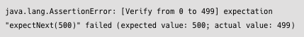

# 13장

# 13 Testing

- Reactor에서는 reactor-test라는 테스트 전용 모듈을 통해 여러가지 유형의 테스트 지원함

```java
dependencies {
		testInplementation 'io.projectreactor:reactor-test'
}
```

## 13.1 StepVerifier를 사용한 테스팅

- Reactor에서 가장 일반적인 테스트 방식
  - Flux 또는 Mono를 Reactor Sequence로 정의한 후, 구독 시점에 해당 Operator 체인이 시나리오대로 동작하는지 테스트
  - Reactor Sequence에서 다음 발생할 Signal? 기대하던 데이터들이 emit? 특정 시간동안 emit된 데이터가 있나? 등등
- Reactor에서는 Operator 체인의 다양한 동작 방식 테스트위해 StepVerifier API 제공함

### Signal 이벤트 테스트

- StepVerifier를 이용한 가장 기본적 테스트방식 = Reactor Sequence에서 발생하는 Signal 이벤트를 테스트하는 것

```java
@Test
public void sayHelloReactorTest() {
		StepVerifier
					.create(Mono.just("Hello Reactor")) //테스트 대상 Sequence 생성
					.expectNext("Hello Reactor")        //emit된 데이터 기댓값 평가
					.expectComplete()                   //onComplete Signal 기댓값 평가
					.verify();                          //검증 실행
}
```

- StepVerifier API 이용한 Operator 체인 기본적 테스트방법
  1. create() 를 통해 대상 Sequence를 생성
  2. expectXXXX()를 통해 Sequence에서 예상되는 Signal의 기댓값을 평가
  3. verify()를 호출함으로써 전체 Operator 체인의 테스트를 트리거

<expectXXXX() 메서드>

- **expectSubscription()**: 구독이 이루어짐을 기대
- **expectNext(T t)**: onNext Signal을 통해 전달되는 값이 전달된 값과 같다
- **expectComplete()**: onComplete Signal이 전송되길 기대
- **expectError()**: onError Signal이 전송되길 기대
- expectNextCount(long count): 구독 시점 또는 이전 expectNext()를 통해 기댓값이 평가된 데이터 이후부터 emit된 수를 기대
- **expectNoEvent(Duration duration)**: 주어진 시간 동안 Signal 이벤트가 발생하지 않았음을 기대
- **expectAccessibleContext()**: 구독 시점 이후에 Context가 전파되었음을 기대
- **expectNextSequence(Iterable<? extends ?> iterable)**: emit된 데이터들이 파라미터로 전달된 iterable의 요소와 매치됨을 기대

<테스트 대상 Operator 체인에 대한 검증을 트리거하는 메서드>

- verifyXXXX() 메서드가 호출되면 내부적으로 테스트 대상 Operator 체인에 대한 구독이 이루어지고 기댓값을 평가하게 됨
- **verify()**: 검증을 트리거
- **verifyComplete()**: 검증을 트리거하고, onComplete Signal을 기대
- **verifyError()**: 검증을 트리거하고, onError Signal을 기대
- **verifyTimeout(Duration duration**): 검증을 트리거하고, 주어진 시간이 초과되어도 Publisher가 종료되지 않음을 기대

```java
public static Flux<String> sayHello() {
		return Flux
					.just("Hello", "Reactor");
}

public static Flux<Integer> divideByTow(Flux<Integer> source) {
		return source
					.zipWith(Flux.just(2,2,2,2,0), (x,y) -> x/y);
}

public static Flux<Integer> takeNumber(Flux<Integer> source, long n) {
		return source.take(n);
}
```

### 1) sayHello() 테스트

```java
@Test
public void sayHelloTest() {
		StepVerifier
				.create(GeneralTestExample.sayHello())
				.expectSubscription()
				.as("# expect subscription")
				.expectNext("Hi")
				.as("# expect Hi") //여기서 오류난다고 나옴
				.expectNext("Reactor")
				.as("# expect Reactor")
				.verifyComplete();
}
```

- as() : 이전 기댓값 평가단계에 대한 설명(description)을 추가가능
- 테스트에 실패하면 실패한 단계에 해당하는 설명이 로그로 출력됨
  - Subscription, next, next, onComplete 테스트함
  - Hi를 기대했지만 Hello임

### 2) divideByTwo() 테스트

```java
@Test
public void divideByTwoTest() {
	Flux<Integer> source = Flux.just(2,4,6,8,10);
	StepVerifier
					.create(GeneralTestExample.divideByTwo(source))
					.expectSubscription()
					.expectNext(1)
					.expectNext(2)
					.expectNext(3)
					.expectNext(4)
			//  .expectNext(1,2,3,4) -> 여러 개 emit된 데이터 평가가능
					.expectError()
					.verify();
}
```

- divideByTwo() 메서드 테스트함
  - 파라미터로 받은 Source Flux에서 emit 되는 각각의 데이터를 2로 나눈 작업을 수행한 결과 값을 emit함
- 마지막에 emit된 데이터는 2가 아닌 0으로 나누는 작업 함 → ArithmaticException 발생
  - expectError → 최종 테스트 결과는 pass

### 3) takeNumber() 테스트

```java
@Test
public void takeNumberTest() {
		Flux<Integer> source = Flux.range(0, 1000);
		StepVerifier
					.create(
								GeneralTestExample.takeNumber(source, 500),
								StepVerifierOptions.create().scenarioName("Verify from 0 to 499")
					)
					.expectSubscription()
					.expectNext(0)
					.expectNextCount(498)
					.expectNext(500) //499가 나와야함
					.expectComplete()
					.verify();
}
```

- Source Flux에서 파라미터로 전달된 숫자 개수만큼 데이터를 emit하는 메서드
- StepVerifierOptions는 StepVerifier에 옵션을 덧붙이는 작업을 하는 클래스
  - 테스트에 실패할 경우 파라미터로 입력한 시나리오명 출력
- 다음 단계로 기댓값을 평가함
  1. expectSubscription()으로 구독 발생 기대
  2. expectNext()로 숫자 0이 emit되었음을 기대
  3. expectNextCount()로 498개의 숫자가 emit되었음을 기대
  4. expectNext()로 숫자 500이 emit되었음을 기대
  5. expectComplete()로 onComplete Signal이 전송됨을 기대



- 첫 번째 emit된 숫자 0을 평가하고, expectNextCount() → 그 다음부터 emit된 데이터의 개수가 498개 기대 → 499개가 emit된 상태
- emit된 숫자가 0부터 시작, 마지막으로 평가해야 되는 기댓값이 499인데 500을 기대

### 시간 기반(Time-based) 테스트

- StepVerifier는 가상의 시간을 이용해 미래에 실행되는 Reactor Sequence의 시간을 앞당겨 테스트할 수 있는 기능을 지원함

```java
public static Flux<Tuple2<String, Integer>> getCOVID19Count(Flux<Long> source) {
		return source
					.flatMap(notUse -> Flux.just(
							Tuples.of("서울", 10),
							Tuples.of("서울", 10),
							Tuples.of("서울", 10),
							Tuples.of("서울", 10),
							Tuples.of("전라도", 8),
							Tuples.of("인천", 2),
							Tuples.of("대전", 1),
							Tuples.of("대구", 2),
							Tuples.of("부산", 3),
							Tuples.of("제주도", 0)
					)
}

public static Flux<Tuple2<String, Integer>> getVoteCount(Flux<Long> source) {
		return source
						.zipWith(Flux.just(
													Tuples.of("중구", 15400),
													Tuples.of("서초구", 20020),
													Tuples.of("강서구", 32040),
													Tuples.of("강동구", 14506),
													Tuples.of("서대문구", 35650)
									)
						)
						.map(Tuple2::getT2);
}
```

- 특정 시간과 연관 지어서 테스트 ㄱㄱ

**<getCovid19CountTest>**

```java
@Test
public void getCOVID19CountTest() {
		StepVerifier
				.withVirtualTime(() -> TimeBasedTestExample.getCOVID19Count(
										Flux.interval(Duration.ofHours(1)).take(1)
						)
				)
				.expectSubscription()
				.then(() -> VirtualTimeScheduler
													.get()
													.advanceTimeBy(Duration.ofHours(1))
				)
				.expectNextCount(11)
				.expectComplete()
				.verify();
}
```

- 현재 시점에서 1시간 뒤에 COVID-19 확진자 발생 현황을 체크하고자 하는데 테스트
  - 대상 메서드의 Sequence가 1시간 뒤에 실제로 동작하나?
- 이런 테스트 대비하기 위해 Reactor Test모듈에서 여러가지 방법 제공함
- **withVirtualTime()** 메서드
  - VirtualTimeScheduler라는 가상 스케줄러의 제어를 받도록 해줌
  - 구독에 대한 기댓값 평가하고
  - then() 메서드로 후속 작업 할 수 있게 함 - advenceTimeBy()로 1시간 당기는 작업 수행
- expectNextCount()를 통해 emit된 데이터가 11개임을 기대

```java
@Test
public void getCOVID19CountTest() {
		StepVerifier
					.create(
							TimeBasedTestExample.getCOVID19Count(
											Flux.interval(Duration.ofMinutes(1)).take(1)
							)
					)
					.expectSubscription()
					.expectNextCount(11)
					.expectComplete()
					.verify(Duration.ofSeconds(3)); //3초 내에 기댓값의 평가가 끝나지 않으면 시간초과
}
```

- 시간 제한 예제
- 지정한 시간 내에 테스트 대상 메서드의 작업 종료 여부 확인
- 1분 뒤에 데이터를 emit하도록 설정함 → 시간초과, AssertionError

```java
@Test
public void getVoteCountTest() {
		StepVerifier
					.withVirtualTime(() -> TimeBasedTestExample.getVoteCount(
												Flux.interval(Duration.ofMinutes(1))
					)
					.expectSubscription()
					.expectNoEvent(Duration.ofMinutes(1))
					.expectNoEvent(Duration.ofMinutes(1))
					.expectNoEvent(Duration.ofMinutes(1))
					.expectNoEvent(Duration.ofMinutes(1))
					.expectNoEvent(Duration.ofMinutes(1))
					.expectNextCount(5)
					.expectComplete()
					.verify();
		)
}
```

- expectNoEvent() → 지정한 시간 동안 어떤 Signal 이벤트도 발생하지 않길 기대
- 다섯 개 구 중 한 개 구의 투표현황을 한 번씩 순차적으로 확인, 테스트 끝날 때까지 5분 소요
  - onNextSignal이벤트 한 번 발생하면 다음 이벤트 발생하기 전까지 1분동안 아무 이벤트도 발생 x
- 테스트 시간 줄이기위해 withVirtualTime() → StepVerifier 메서드 체인들이 VirtualTimeScheduler의 제어를 받도록 함
- expectNoEvent() → 1분 동안 onNext Signal 이벤트가 발생하지 않을 것이다!
  - expectNoEvent()의 파라미터로 시간 지정하면 지정한 시간 동안 어떤 이벤트도 발생x 기대 + 지정한 시간 만큼 시간을 앞당김
  - 결과적으로 다섯 번의 expectNoEvent() 호출 → 5분 시간 앞당김

### Backpressure 테스트

- StepVerifier로 Backpressure 테스트가능!

```java
public static Flux<Integer> generateNumber() {
		return Flux
						.create(emitter -> {
										for (int i =1; i<=100; i++) {
												emitter.next(i);
										}
										emitter.complete();
								},
								FluxSink.OverflowStartegy.ERROR
						);
}
```

- create() Operator 내부에서 for 문을 이용해 프로그래밍 방식으로 100개 숫자 emit
- Backpressure 전략으로 ERROR → 오버플로 발생 시 OverflowException 발생

```java
@Test
public void generateNumberTest() {
		StepVerifier
					.create(BackpressureTestExample.generateNumber(), 1L)
					.thenConsumeWhile(num -> num >= 1)
					.verifyComplete();
}
```

- 정상적으로 Sequence가 종료함을 기대
- failed
  - 테스트 대상 클래스의 generateNumber() → 한 번에 100개 숫자 데이터 emit
  - StepVerifier의 create() 메서드에서 데이터의 요청 개수를 1로 지정해서 overflow 발생
- thenConsumeWhile() → emit되는 데이터를 소비
  - 예상보다 더 많은 데이터를 수신! 오버플로 발생
  - onError Signal

```java
@Test
public void generateNumberTest() {
		//pass
		StepVerifier
				.create(BackpressureTestExample.generateNumber(), 1L)
				.thenConsumeWhile(num -> num >= 1)
				.exeptError()
				.verifyThenAssertThat()
				.hasDroppedElements();
}
```

- 오버플로로 인해 에러 발생기대
  - expectError(): 에러를 기대
  - 오버플로로 인해 내부적으로 Drop된 데이터가 있음을 Assertion
  - verifyThenAssertThat(): 검증을 트리거하고 난 후, 추가적인 Assertion 가능
    - hasDroppedElements() 메서드를 이용해 Drop된 데이터가 있음을 Assertion
- 오버플로 → onError Signal → Drop되는 데이터 있음

### Context 테스트

Reactor Sequence에서 사용되는 Context도 테스트가능

```java
public static Mono<String> getSecretMessage(Mono<String> keySource) {
	return keySource
					.zipWith(
							Mono.deferContextual(ctx -> Mono.just((String)ctx.get("secretKey")))
					)
					.filter(tp -> tp.getT1().equals(
							new String(Base64Utils.decodeFromString(tp.getT2())))
					)
					.transformDeferredContextual(
							(mono, ctx) -> mono.map(notUse -> ctx.get("secretMessage"))
					);
}
```

- Bse64 형식으로 인코딩된 secret key
- secret key에 해당하는 secret message가 저장됨
- getSecretMessage(): 파라미터로 입력받은 Mono<String> keySource와 Context에 저장된 secret key 값을 비교, 일치하면 secretMessage return

```java
@Test
public void getSecretMessageTest() {
	Mono<String> source = Mono.just("hello");

	StepVerifier
				.create(
						ContextTestExample
							.getSecretMessage(source)
							.contextWrite(context -> context.put("secretMessage", "Hello Reactor"))
							.contextWrite(context -> context.put("secretKey", "agasdew-"))
				)
				.expectSubscription() //구독 발생 기대
				.expectAccessibleContext() //구독 이후 Context 전파기대
				.hasKey("secretKey")
				.hasKey("secretMessage")
				.then()                      //sequence의 다음 signal 이벤트 기댓값 평가 ㄱ
				.expectNext("Hello Reactor") //해당 문자열 emit 기대
				.expectComplete()            //onComplete
				.verify();
}
```

- hello를 base64 인코딩한 문자열 ㅇㅇ

### Record 기반 테스트

- expectNext()로 emit된 데이터의 조금 더 구체적인 조건으로 Assertion해야하는 경우가 많음
- **recordWith()**사용!
  - 파라미터로 전달한 java의 컬렉션에 emit된 데이터를 추가하는 세션을 시작함
- 컬렉션에 기록된 데이터에 다양한 조건 지정 → emit된 데이터 검증

```java
public static Flux<String> getCapitalizedCountry(Flux<String> source) {
	return source
				.map(country -> country.substring(0,1).toUpperCase() + country.substring(1));
}
```

- 알파벳 국가명 받아서 첫 글자를 대문자로 변환하도록 정의된 flux return

```java
@Test
public void getCityTest() {
	StepVerifier
			.create(RecordTestExample.getCapitalizedCountry(
								Flux.just("korea", "england", "canada", "india")))
			.expectSubscription()             //구독 발생 기대
			.recordWith(ArrayList::new)       //emi된 데이터에 대한 기록 시작
			.thenConsumeWhile(country -> !country.isEmpty()) //일치데이터 다음단계 ㄱ
			.consumeRecordWith(countries -> { //컬렉션에 기록된 데이터 소비
					assertThat(
							countries
									.stream()
									.allMatch(country -> Character.isUpperCase(country.charAt(0))),
							is(true)
					);
			})
			.expectComplete()
			.verify();
}
```

```java
@Test
public void getCityTest2() {
	StepVerifier
			.create(RecordTestExample.getCapitalizedCountry(
								Flux.just("korea", "england", "canada", "india")))
			.expectSubscription()             //구독 발생 기대
			.recordWith(ArrayList::new)       //emi된 데이터에 대한 기록 시작
			.thenConsumeWhile(country -> !country.isEmpty()) //일치데이터 다음단계 ㄱ
			.expectRecordedMatches(countries ->  //컬렉션에 기록된 데이터 소비
					countries
							.stream()
							.allMatch(country -> Character.isUpperCase(country.charAt(0))))
			.expectComplete()
			.verify();
}
```

- expectRecordedMatches 로 간결하게

## 13.2 TestPublisher를 사용한 테스팅

- reactor-test 모듈에서 지원하는 테스트 전용 Publisher → TestPublisher 사용해서 테스트 가능

### 정상 동작하는(Well-behaved) TestPublisher

- TestPublisher를 사용하면, 개발자가 직접 프로그래밍 방식으로 **signal 발생시키면서** 원하는 상황미세하게 재연하며 테스트가능
- Well-behaved TestPublisher
  - emit하는 데이터가 Null인지, 요청하는 개수보다 더 많은 데이터를 emit하는지 등ㅇ
  - **액티브 스트림즈 사양 위반 여부를 사전에 체크**한다

```java
@Test
public void divideByTwoTest() {
	TestPublisher<Integer> source = TestPublisher.create();

	StepVerifier
			.create(GeneralTestExample.divideByTwo(source.flux()))
			.expectSubscription()
			.then(() -> source.emit(2,4,6,8,10))
			.expectNext(1,2,3,4)
			.expectError()
			.verify();
}
```

- 테스트단계

  1. TestPublisher 생성
  2. 테스트 대상 클래스에 파라미터로 flux 전달(변환 ㅇㅇ)
  3. 테스트에 필요한 데이터 emit

- TestPublisher를 사용하면 복잡한 로직이 포함된 대상 메서드를 테스트하거나 조건에 따라 Signal을 변경해야 되는 등의 특정 상황 테스트 용이
- TestPublisher가 발생시키는 Signal 유형
  - **next(T…)** : 1개 이상의 onNext Signal 발생시킴
  - **emit(T…)** : 1개 이상의 onNext 발생시킨 후 onComplete Signal 발생시킴
  - **complete()** : onComplete signal 발생시킴
  - **error(Throwable)** : onError signal 발생시킴

### 오동작하는(Misbehaving) TestPublisher

- 리액티브 스트림즈의 사양을 위반하는 상황이 발생 테스트 가능
- Misbehaving TestPublisher:
  - 리액티브 스트림즈 사양 여부를 사전에 체크하지 않음
  - 사양에 위반되더라도 TestPubslisher는 데이터를 emit 가능

```java
@Test
public void divideByTwoTest() {
	//TestPublisher<Integer> source = TesetPublisher.create(); //정상동작 publisher

	//오동작 publisher
	TestPublisher<Integer> source =
			TestPublisher.createNoncompliant(TestPublisher.Violation.ALLOW_NULL);

	StepVerifier
		.create(GeneralTestExample.divideByTwo(source.flux()))
		.expectSubscription()
		.then(() -> {
				getDataSource().stream()
						.forEach(data -> source.next(data));
				source.complete();
		})
		.expectNext(1,2,3,4,5)
		.expectComplete()
		.verify();
}

private statis List<Integer> getDataSource() {
	return Arrays.asList(2,4,6,8,null);
}
```

- ALLOW_NULL 위반 조건 지정 → 데이터값이 null이라도 정상 동작하는 TestPublisher 생성
- onNextSignal을 전송하는 과정에서 NullPointerException 발생
- 정상동작하는 Publisher의 경우 onNext Signal을 전송하기 전 Validation 과정을 거쳐 전송할 데이터가 Null이면 NullPointerException 던짐

## 13.3 PublisherProbe를 사용한 테스팅

- reactor-test 모듈은 PublisherProbe를 이용해 **Sequence의 실행 경로 테스트** 가능
  - 주로 조건에 따라 sequence가 분기되는 경우
  - → Sequence의 실행 경로를 추적해서 정상적으로 실행되었는지 테스트

```java
//주전력을 사용해서 작업하다가 -> 끊겼을 경우에만 예비 전력을 사용해서 작업을 진행하는 상황
public static Mono<String> processTask(Mono<String> main, Mono<String> stadby) {
	return main
				.flatMap(message -> Mono.just(message))
				.switchIfEmpty(standby);
)

public static Mono<String> supplyMainPower() {
	return Mono.empty();
}

public static Mono supplyStandbyPower() {
	return Mono.just("# supply Standby Power");
}
```

- 주전력이 끊겼을 때 예비전력을 사용하도록 하는 Operator → switchIfEmpty()
  - Upstream Publisher가 데이터 emit없이 종료되는 경우, 대체 Publisher가 데이터를 emit

```java
@Test
public void publisherProbeTest() {
	PublisherProbe<String> probe =
				PublisherProbe.of(PublisherProbeTestExample.supplyStandbyPower());

	StepVerifier
			.create(PublisherProbeTestExample
							.processTask(
									PublisherProbeTestExample.supplyMainPower(),
									probe.mono())
					)
					.expectNextCount(1)
					.verifyComplete();

	probe.assertWasSubscribed();   //구독을 했나?
	probe.assertWasRequested();    //요청을 했나?
	probe.assertWasNotCancelled(); //중간에 취소됐나?
}
```

- StepVerifier를 이용해서 processTask() 메서드가 데이터를 emit하고 정상종료 테스트
- 해당 **Publisher의 실행경로를 테스트**함
  - Sequence의 Signal이벤트 뿐만 아니라
  - switchEmpty() Operator로 인해 Sequence가 분기되는 상황에서 **실제 어느 Publisher가 동작**하는지
- supplyMainPower() 메서드는 Mono.empty()를 리턴함
  - processTask() 메서드는 최종적으로 Mono<String> standby가 동작함
